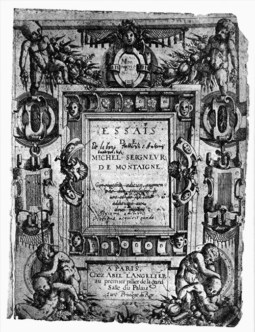
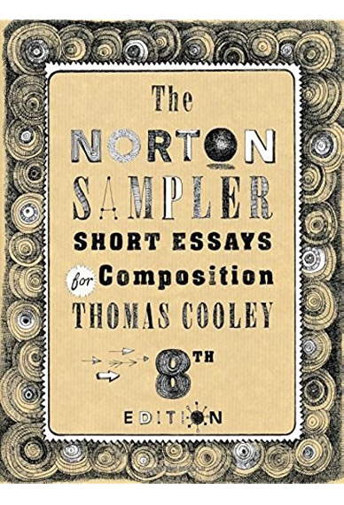

## Introduction – what is an essay?

Every week during this module, you are invited to write a small piece of text – a small *essay*.

The word 'essay' comes from the French verb 'essayer', which means 'to try' or 'to attempt'. An essay is a journey into a writer’s mind, a writer thinking on the page, allowing the reader to travel alongside them. The essence of an essay is the trying.

It was the French stateman and thinker [Michel de Montaigne]() who first described his work as 'essays', as 'attempts to put his thoughts into writing'.

An essay doesn’t know where it’s going, doesn’t know its end result beforehand. Oftentimes a writer begins with an idea of how an essay might turn out and writes themselves off the path that they intended to take, digressing and transitioning between topics. But, at the center of an essay is a driving question or an idea that the essayist wishes to uncover, to sift through.

An essay is a piece of writing, usually from an author's personal point of view. Essays are non-fictional but often subjective; while expository, they can also include narrative. Essays can be literary criticism, political manifestos, learned arguments, observations of daily life, recollections, and reflections of the author. 

The definition of an essay is vague, overlapping with those of an article and a short story. Almost all modern essays are written in prose and are brief, while there are a lot exceptions to this rule. 

## Different types of essay

Though the categorization is somewhat vague, one can distinquish different kinds of essays. During this module, we will visit some of these essay:

- Description essay: **description** to show how something looks, feels, smells, sounds or tastes 
     
- Narrative essay: **narrative** to tell what happened to your subject (plot: intro/climax/resolution) 
      
- Example essay: **exemplification** to give specific instances of a general group or idea , making the general specific

- Classification essay: **classification** to explain what categories your subject belongs to 
   
- Comparison/contrast essay: **compare and contrast** to trace similarities and differences 
     
- Definition essay: **definition** to explain what your subject is or does
     
- Cause and effect essay: **cause and effect** to explain what caused something or what its effects are 
     
- Argumentative essay: **argument** to make a case or justify a position 
     
- Process essay: **process** to explain how to do something or how something occurs, how one thing leads to another. 
     
- Projection essay: **projection** to project yourself in something else (another/animal/plant) and try to understand that thing from inside   out, give a voice to the voiceless, 
    
- Lyrical essay: **lyricalize** (write personally poetically) to uses many poetic tools to convey creative nonfiction. 

## The Writing Process

Writing is not a linear process: We plan, we draft, we revise, we plan, we draft, we revise again, we rewrite. You can be busy with different things at the same time. 

Have a look at selected segments from chapter 2 from the book [The Northern Sampler](https://wwnorton.com/books/The-Norton-Sampler/).

At the beginning you babble. Often you don’t know where the work is going, so you can’t tell what’s irrelevant. It doesn’t hurt much to babble in a first draft, so long as you have the sense to cut out irrelevancies later.

