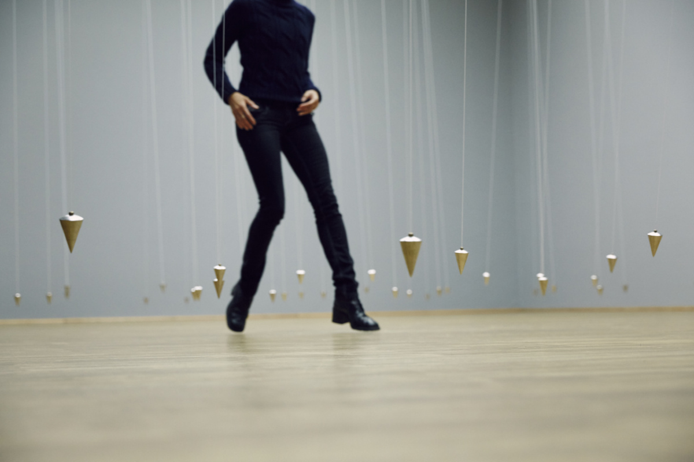
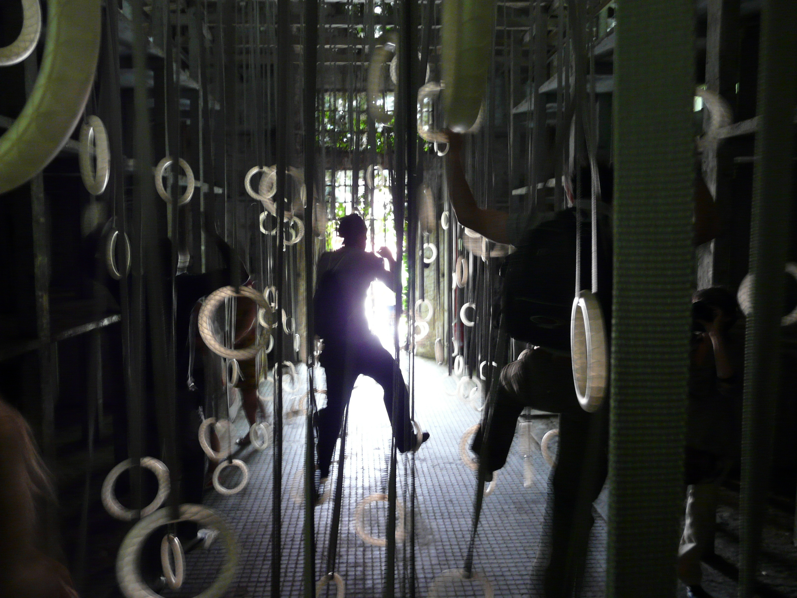
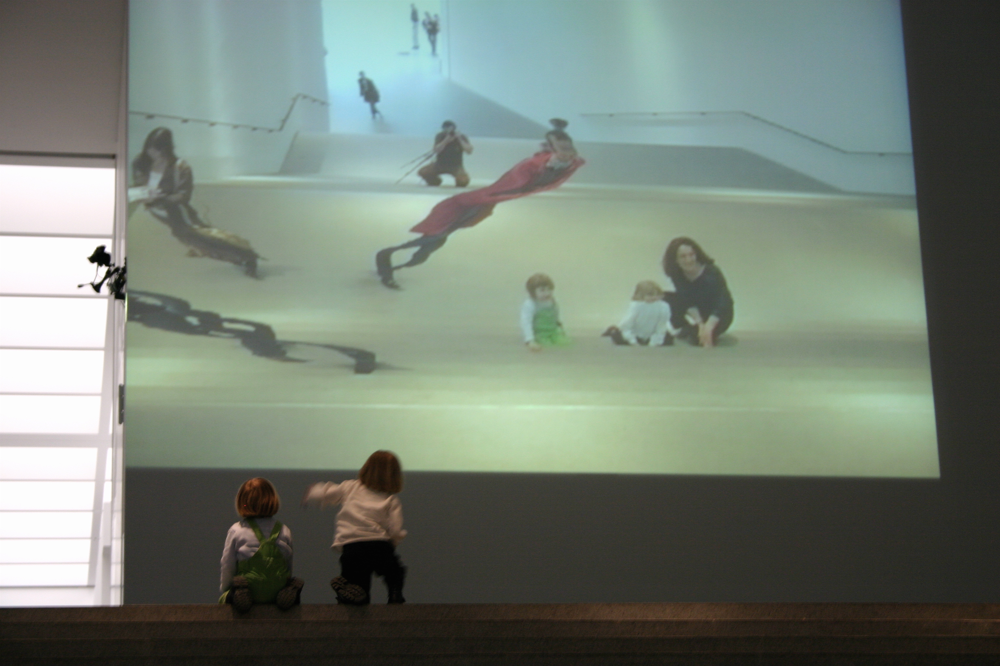
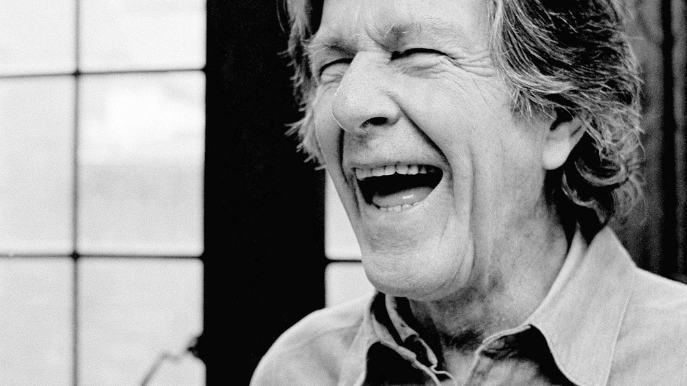
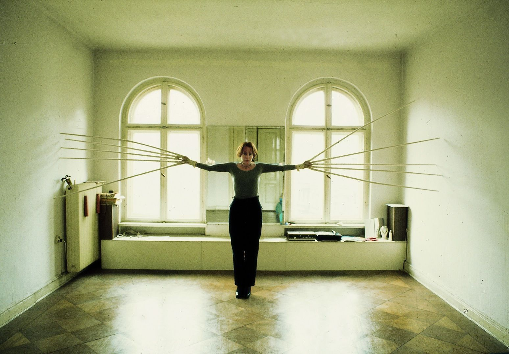
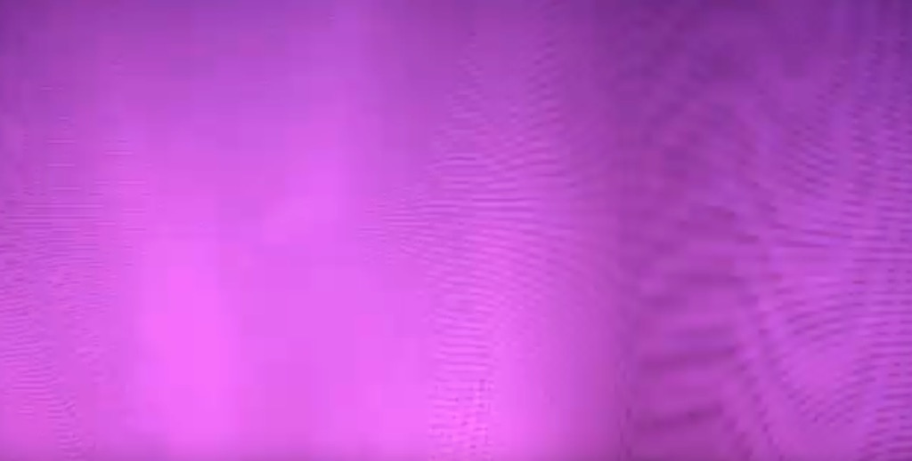

# 1. World and Reality

> Die Welt ist alles, was der Fall ist

## Introduction: Resonance

When we look around in our world, we encounter a lot of stuff in it: chairs, telephones, planes, trains, or automobiles. However, this stuff *means* something to us: we can use a chair to sit on, or a train to get from A to B.

However, apart from this more functional meaning, the stuff we encounter also has a particula meaning *for* us: my telephone means something to me, as yours does to you. However, the meaning I attach to my telephone is (in all likelihood) *different* from the meaning you attach to yours.

And it is probable that you have some stuff that only has a *meaning*, a *significance* for you, like a stone you picked up when you were a kid, some poster or design you created when you were a juvenile. Or there are things that mean something to you and to people like you, or you gravitate towards (kind of) people that attach (kind of) the same significance to the same (kind of) objects...

All this leads us to conclude that the world we experience is something different than the object we encounter in it. In this first session, we are going to investigate the way this works. In so doing, we will look into *resonance* as a meaningful way of relating to the world.

## Practical exercise

In the practical exercise you are asked to think about the way you interact with the things when commuting to the academy. We will take four (or five) steps to analyse this interaction and eventually distill one central term out of it. 

## Writing exercise

__Part 1__

Read [the (definition and example) essay *The Idea of Resonance as a Sociological Concept* by Hartmut Rosa](files/the-idea-of-resonance-as-a-sociological-concept_by-hartmut-rosa.pdf). First, skim the text to get an overview without trying to fully understand it – just to get a sense of what it’s about.

Then, read the text closely and critically.

As you go, process the text: annotate by jotting down questions or comments in the margins, underlining important points, circling keywords, and marking places you may want to revisit. Feel free to underline, scribble, or doodle – this is what we call the *processed text*. 

The processed text will be part of your exercises book. 

__Part 2__

a. Think of a word that covers something that interests, fascinates, or intrigues you — something that resonates with you. Start writing from this keyword, following the six *freewriting points* below. Just let your associative, emotional mind guide you, without knowing exactly where the text will take you. You might end up somewhere unexpected.

b. Cut out the parts you don’t need, or that feel too personal to share, and edit the text. Check whether the sentences need to be clearer or more logical, whether you want to add a sentence for clarity, and whether the parts can be shaped into a more coherent whole.

The  text will also be part of your exercises book.

Take *ten minutes* to write a text according to the six points below. The basic unit of this practice is the timed exercise. Time yourself for ten minutes and commit yourself to those ten minutes and for that full period.

1.	Keep your hand moving. (Don't pause to reread the line you have just written. That's stalling and trying to get control of what you're saying.)
2.	Don’t cross out. (That is editing as you write. Even if you write something you didn't mean to write, leave it.)
3.	Don’t worry about spelling, punctuation, grammar. (Don't even care about staying within the margins and lines on the page.)
4.	Lose control.
5.	Don’t think. Don’t get logical.
6.	Go for the jugular. (If something comes up in your writing that is scary or naked, dive right into it. It probably has lots of energy.)

Next time, we will use this text as input for an editing-exercise, so be sure to take it with you to the next class.

## Examples

__William Forsythe: Nowhere and Everywhere at the Same Time__

Suspended from automated grids, more than 400 pendulums are activated to initiate a sweeping 15 part counterpoint of tempi, spacial juxtaposition and gradients of centrifugal force which offers the spectator a constantly morphing labyrinth of significant complexity. The spectators are free to attempt a navigation this statistically unpredictable environment, but are requested to avoid coming in contact with any of the swinging pendulums.

[See this installation on youtube](https://www.youtube.com/watch?v=as1bQ6Xl_fg)

[Read the description by William Forsythe](https://www.williamforsythe.com/exhibitions.html?detail=1&uid=54)

__William Forsythe: The Fact of the Matter__

The Fact of Matter is a choreographic object. The object is not so much there to be seen, as to be used. An engagement with the object offers the visitor a possible re-assessment of their mass, strength, and coordination skill as a unified system.

[See this installation on youtube](https://www.youtube.com/watch?v=Cn3Ry08vKR4)

[Read the description by William Forsythe](https://www.williamforsythe.com/installations.html?detail=1&uid=29)

__William Forsythe: City of Abstracts__

Through trial and error, viewers learn how to activate themselves in order to know more about their role in the construction of the images on the screen. What results are inadvertent choreographies, initiated through inquiry, not intent. 

[See this installation on youtube](https://www.youtube.com/watch?v=R3ZNB-tDj5c)

[Read the description by William Forsythe](https://www.williamforsythe.com/installations.html?detail=1&uid=5)

## Lectures

__John Cage about Silence__

John Cage is the composer of [the famous piece 4'33"](). With this work, he questions the role of silence in music. At the time of its conception, Cage was studying Zen Buddism under [Daisetz Suzuki](https://en.wikipedia.org/wiki/D._T._Suzuki), which led him to conclude that "each and every thing in all of time and space is related to each and every other thing in all of time and space". In [this interesting lecture on youtube](https://www.youtube.com/watch?v=pcHnL7aS64Y), he talks about the role of silence in his philosophy and musical compositions.

__Tate Collective: Rebecca Horn – Body Extensions and Isolation__

Rebecca Horn was a German visual artist best known for her installation art, film directing and body modifications such as Einhorn (Unicorn), a body-suit with a very large horn projecting vertically from the headpiece [wikipedia](https://en.wikipedia.org/wiki/Rebecca_Horn). In [this video on youtube](https://www.youtube.com/watch?v=6uEkq3IBIf0), Joey from Tate Collective London presents her perspective on this performative artwork.

__Sonic Acts: Philip Vermeulen on making More Moiré__
r
Philip Vermeulen on the making of More Moiré (Sonic Acts). See [this presentation on youtube](https://www.youtube.com/watch?v=PWB1mLQU8-g).

## Keyterms

- Resonance
- Alienation
- Body and world
- Body and self

## Literature

- Rosa, H., 2018, [The Idea of Resonance as a Sociological Concept](https://globaldialogue.isa-sociology.org/articles/the-idea-of-resonance-as-a-sociological-concept)

- Rosa (2022):
    - §§IV.3, IV.4 (pp.211-224; english edition: pp.126-137)
    - §§V.3, V.4 (pp.281-315; english edition: pp.164-183)

