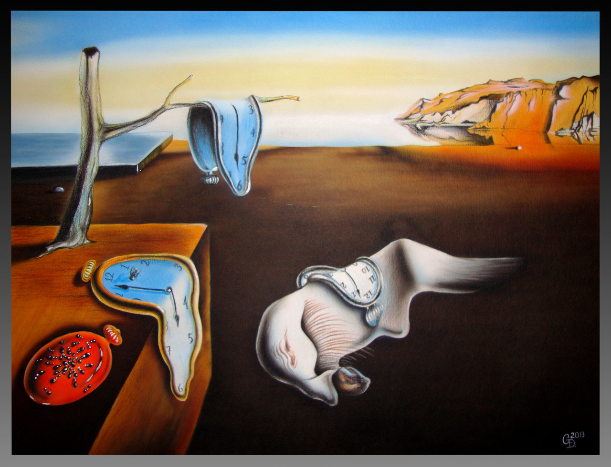
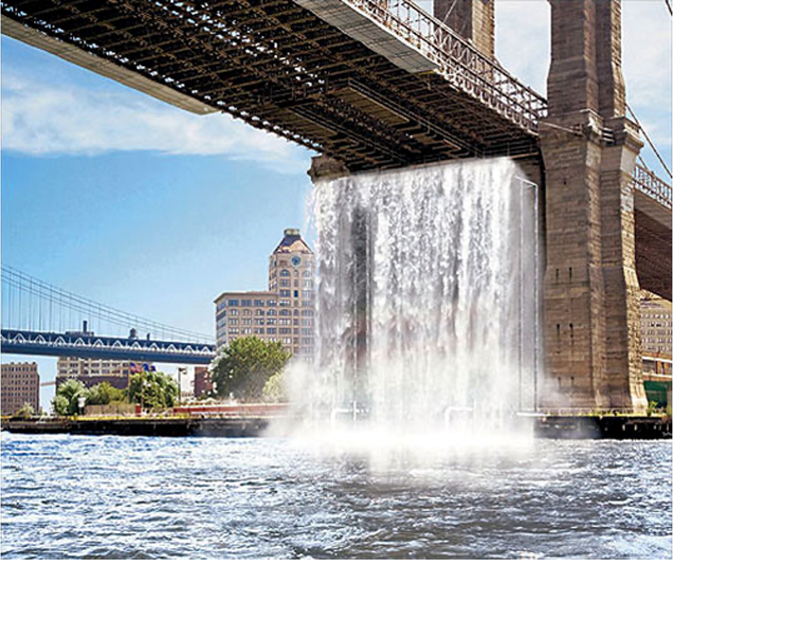

# Exercises week 2

## Practical exercise

In this week's exercise, you are asked to work in duo's, go outside (of the classroom) and locate a particular space (and come up with the experience of time at that place). Next, you need to create some kind of intervention to change the (perception of) space and (the perception) of time. 

### Part 1

- Form pairs.
- Outside or inside the building, investigate two different (types of) spaces (e.g. cafeteria versus workshop). Where do they differ and where do they agree in (the perception of) time and space?
- Have an open mind for your own influence. How do you influence your experience of time and space, and what is the relation between you and your surroundings?
- Choose two spaces.

### Part 2
- Think about interventions that you can use to change (these perception of) time and space.
- Think about adding or removing light or sound, changing  the position or orientation of furniture, rituals, ... 
- Perform these interventions.
- Discuss the results with each other.

### Part 3
Document your experiments with photos and / or video's. Make pictures of the space before and after your intervention.

## Textual exercises

__Part 1: Reading__

Read the article [The Tyranny Of Time](https://www.noemamag.com/the-tyranny-of-time/), written in 2021 by [Joe Zadeh](https://www.joezadeh.com/about). Come up with one or two questions about this text that you want to discuss in class.

Read the text closely and critically. As you go, process the text: annotate by jotting down questions or comments in the margins, underlining important points, circling keywords, and marking places you may want to revisit. Feel free to underline, scribble, or doodle. 

The processed text will be part of your portfolio. 

__Part 2: Writing__

Using your experience of the practical assignment, please write [a *comparison/contrast essay*](../essay.md#different-types-of-essay) in which you compare the situation (in space, in time) *before* and *after* your intervention.

- Describe what you are going to investigate.
- Describe what the space was like *before* the intervention.
- Describe what the space was like *after* the intervention (use reactions of your fellow-student).
- Compare the two. Has the experience of space and time changed?
- Use text, photos and/or video's

