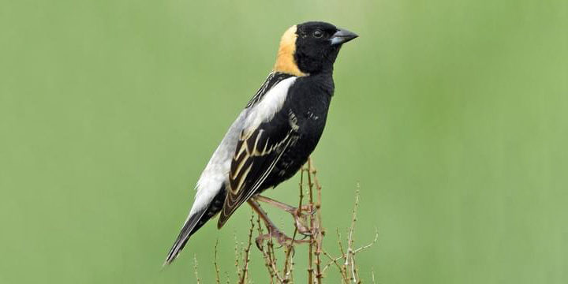

# Nature is what we see

'Nature' is what we see — 
The Hill — the Afternoon — 
Squirrel — Eclipse — the Bumble bee — 
 
Nay — Nature is Heaven — 
Nature is what we hear — 
The Bobolink — the Sea — 
Thunder — the Cricket — 
 
Nay — Nature is Harmony — 
Nature is what we know — 
 
Yet have no art to say — 
So impotent Our Wisdom is 
To her Simplicity. 
 
– Emily Dickenson (1830 - 1886)

