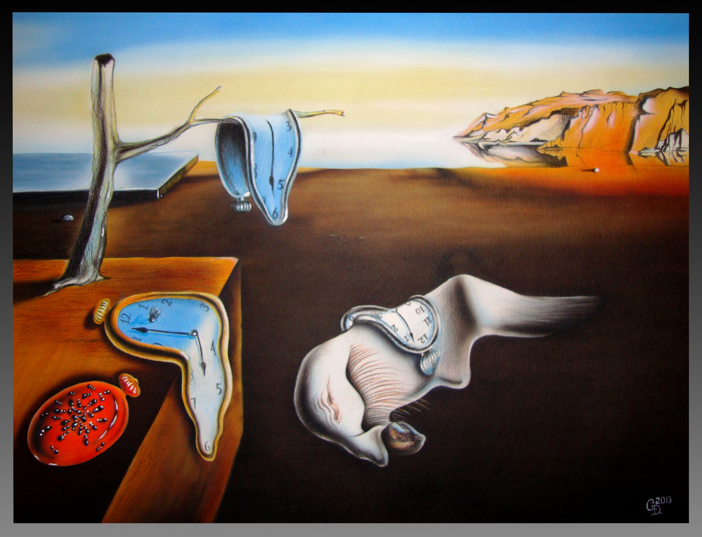

# Exercises week 2

## Practical exercise

In this week's exercise, you are asked to work in duo's, go outside (of the classroom) and locate a particular space (and come up with the experience of time at that place). Next, you need to create some kind of intervention to change the (perception of) space and (the perception) of time. 

## Textual exercises

__Part 1: Reading__

Read the first few pages of ["Clocks, The Scent of Time" (chapter 15 of McLuhan's *Understanding Media*, McLuhan (1964))](../files/mcluhan-clock.pdf). You can, of course, read the whole text, but please read *at least* untill the redish line on page 3. Use the knowledge, insights and vocabulary that we have conveyed during this class to put this text in a broader context.

Come up with one or two questions about this text that you want to discuss in class.

Again, read the text closely and critically. As you go, process the text: annotate by jotting down questions or comments in the margins, underlining important points, circling keywords, and marking places you may want to revisit. Feel free to underline, scribble, or doodle. 

The processed text will be part of your exercises book. 

__Part 2: Writing__

Using your experience of the practical assignment, please write a *comparison/contrast essay* in which you compare the situation (in space, in time) *before* and *after* your intervention.

- Describe what you are going to investigate.
- Describe what the space was like *before* the intervention.
- Describe what the space was like *after* the intervention (use reactions of your fellow-student).
- Compare the two. Has the experience of space and time changed?
- Use text, photos and/or video's

k 2