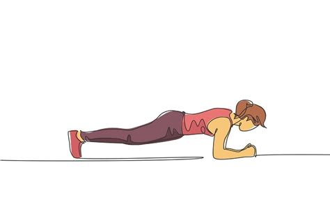

# 2. Time and Space

> Le temps est invention, ou il n’est rien du tout.

– Henri Bergson

## Introduction: Temporalities

In this session, we will look into the phenomena of *Time* and *Space*. We will see that you can look at both of them in (at least) a mathematical and in a phenomenological sense, that there is an inherent friction between those ways of seeing, and that interesting things start to happen when you make this friction explicit.

Time as well as space have a tendency to *flow*: we are living in a time-space continuum and it seems as though there is no escaping this fundamental property of human existence. On the face of it, time and space seem indifferent to human existence.

However, this more mathematical form of time and space, this *isotrope* and *isochrone* ways of experience, doesn't resonate with the way we humans actually experience time or space. When standing in a plank-position, a minute will feel actually quite long, while on the other hand if you are watching an interesting movie the hours will pass without you actually noticing it.

When you are driving over a highway, you probably don't differentiate one view from another. But when you are suddently confronted with a monument, erected to commemorate someone who had an accident there, that particular place stands out from all the other points of the highway. The monument differentiates that place from all the other places of the highway.

We will talk about the way buildings form space in the same way that rituals form time. We follow Martin Heidegger's lead, when he states that mankind *is* only in so far as we *build*:

=== "DE"

    Der Bezug des Menschen zu Orten und durcht Orte zu Räumen beruht im Wohnen. Das Verhältnis von Mensch und Raum ist nichts anderes als das wesentlich gedachten Wohnen. (Heidegger, 2000, p. 160)

=== "EN"

    Man’s relation to locales, and through locales to spaces, inheres in his dwelling. The relationship between man and space is none other than *dwelling*, thought essentially. (Heidegger, 2008, p. 159)

## Examples

Who | What | Where
--|--|--
Olafur Eliasson | Collective Experience | [Youtube](https://www.youtube.com/watch?v=Ksm2eInvuwU)
Alice Cheung | Group 5 Video essay (Psychogeography and Drifting) | [Youtube](https://www.youtube.com/watch?v=wU-6N6l0Cn0)
Marina Abramović | The Artist is Present | [Youtube](https://www.youtube.com/watch?v=taKQwPTtRjg)
David Claerbout | The Shape of Time | [Youtube](https://www.youtube.com/watch?v=RWKVx6DFlO0)
Erwin Wurm | One Minute Sculptures | [Youtube](https://www.youtube.com/watch?v=vX91fcNjhlc)
Cory Arcange | Super Mario Clouds | [Youtube](https://www.youtube.com/watch?v=fCmAD0TwGcQ)
Patrick Jean | Attack of the Pixels | [Youtube](https://www.youtube.com/watch?v=ugV6cLgwomo)

## Lectures

- [David Claerbout interview about Duration in his work.](https://www.youtube.com/watch?v=gTad4uUhK1o)
- [Olafur Eliasson about Playing with Space and Light](https://www.ted.com/talks/olafur_eliasson_playing_with_space_and_light)
- [Interview with Bill Viola: Cameras are Keepers of the Souls ](https://www.youtube.com/watch?v=w3VfWLlkuRI)
- [How Robert Wilson Bends Time](https://www.youtube.com/watch?v=BA67jt8QiKo)
- [James Turrell at the Guggenheim Museum](https://www.youtube.com/watch?v=MVoMJHSNyI0)

## Literature