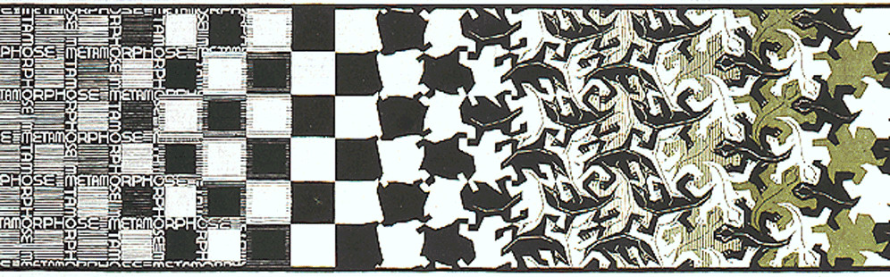

# 3. Fact and Fiction

> La rue assourdissante autour de moi hurlait.

– Charles Beaudelaire

## Introduction: Narratives and Metaphors

We open worlds by telling each other stories. However, in telling these stories, we need to take our own worlds and experiences into account. We cannot expect our audiences to enter into a world that is *so completely different* from our own, that they don't understand *anything* about it. Our experiences, our biological and pyschological make-up, our own *being-in-the-world* dictates the understanding we can have of other worlds. 

In this vain, [Ludwig Wittgenstein](https://en.wikipedia.org/wiki/Ludwig_Wittgenstein) famously once said that 'if a lion could speak, we would not understand it' ('Wenn ein Löwe sprechen könnte, wir könnten ihn nicht verstehen', *philosophische Untersuchungen*, p.223). 

In this session, we will look into different ways in which we can describe the world and objects within it. We will see that an objective description of an object is not really conveying what the object actually *is*. We will see that most of our talk is done using metaphors.

Interestingly, Hartmut Rosa himself that his term 'Resonance' is used fundamentally in a metaphorical sense as well:

=== "DE"
    
    Es kann kein Zwiefel daran bestehen, dass sich der Resonanzbegriff als Metapher zur Beschreibung von Beziehungsqualitäten in hohem Maße eignet und dass er ein enormes Anregungspotential für die Untersuchung von Weltverhältnissen auf nahezu allen Feldern des menschlichen Lebens entfaltet. Allein, eine solche metaphorische Verwendung des Begriffs genügt nicht den konzeptuellen und systematischen Anforderungen, um Resonanz als einen socialphilosophischen Grundbegriff und eine sozialwissenschaftliche Analysekategorie zu etablieren, auf die sich eine umfassende Soziologie der Weltbeziehung aufbauen ließe. (Rosa, 2022, p.281)

=== "EN"

    There can be no doubt that the concept of resonance is a highly suitable metaphor for describing the qualities of relatinships, and that it moreover offers enormous potential for analyzing how human beings relate to the world in nearly every area of life. Merely employing it metaphorically, however, is not sufficient if we wish to conceptually and systematically establish resonance as a fundemental concept of social philosophy and a social-scientific analytical category on which to build a comprehensive sociology of human relationships to the world. (Rosa, 2019, p.164)

## Practical exercise

For this week's practical exercise, we want you to bring an object to class. This should be a practical object you *like* to use, and use on a more or less daily basis. It should, however, *not* (or not per se) have a *sentimental value* for you. So you could e.g. bring a hammer that you like to work with, but not the hammer that you got from your father for your eighteenth birthday.

During class, we will work on coming up with different descriptions of this object, and we will discuss what the most accurate description will be.

## Textual exercises

__Part 1: Reading__

Read "Concepts we Live By", the first chapter of [*Metaphors we Live By*](https://www.umsl.edu/~alexanderjm/MetaphorsWeLiveBy.pdf)(pp. 3-6). Use the knowledge, insights and vocabulary that we have conveyed during this class to put this text in a broader context.

Again, read the text closely and critically. As you go, process the text: annotate by jotting down questions or comments in the margins, underlining important points, circling keywords, and marking places you may want to revisit. Feel free to underline, scribble, or doodle. 

The processed text will be part of your exercises book. 

__Part 2: Writing__

Given the discussion during our class, the examples we talked about and more that you can find below, create an object of your own that works as a metaphor. Make sure you also document the making process by using photos and / or movies. Also, make a *description* of the object and what it is conveying in a metaphorical way.

## Examples
Who | What | Where
--|--|--
Meret Oppenheimer | A Woman's Work | [MoMa](https://www.moma.org/collection/works/80997)
Robert Rauschenberg | Bed | [MoMa](https://www.moma.org/collection/works/78712)
Marcel Duchamp | Fountain | [Wikipedia](https://en.wikipedia.org/wiki/Fountain_(Duchamp))

## Lectures

## Literature