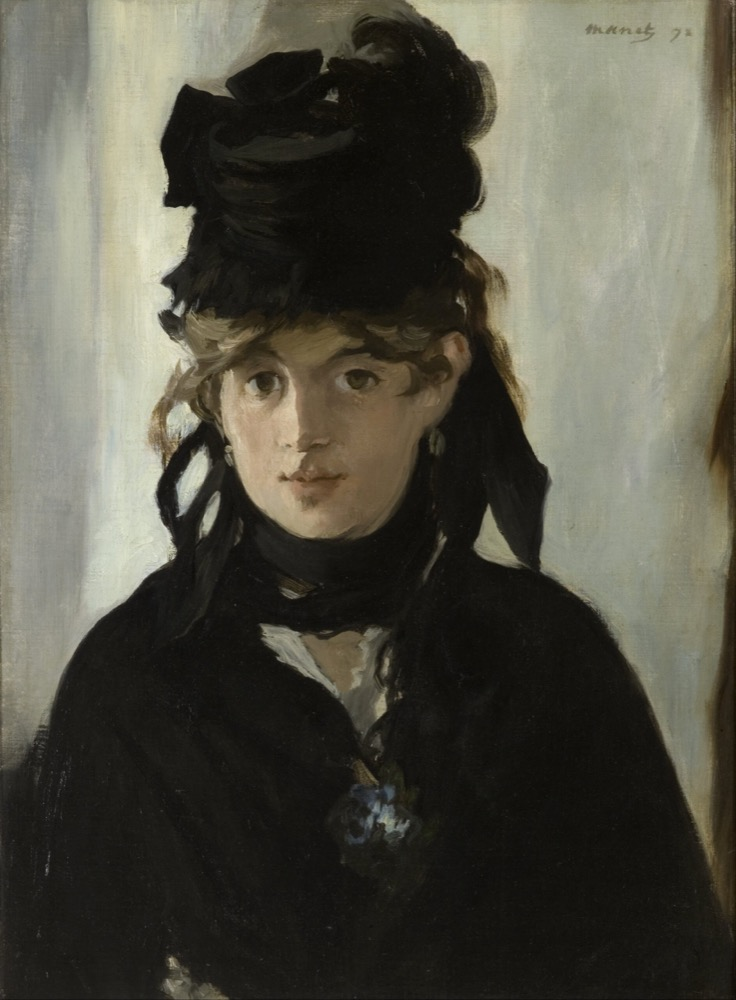

A Une Passante

=== "Français"
    La rue assourdissante autour de moi hurlait.  
    Longue, mince, en grand deuil, douleur majestueuse 
    Une femme passa, d'une main fastueus 
    Soulevant, balançant le feston et l'ourlet 
     
    Agile et noble, avec sa jambe de statue 
    Moi, je buvais, crispé comme un extravagant 
    Dans son oeil, ciel livide où germe l'ouragan 
    La douceur qui fascine et le plaisir qui tue 
     
    Un éclair... puis la nuit! — Fugitive beauté 
    Dont le regard m'a fait soudainement renaître 
    Ne te verrai-je plus que dans l'éternité 
     
    Ailleurs, bien loin d'ici! trop tard! jamais peut-être 
    Car j'ignore où tu fuis, tu ne sais où je vais 
    Ô toi que j'eusse aimée, ô toi qui le savais 

=== "English"
    The street about me roared with a deafening sound.  
    Tall, slender, in heavy mourning, majestic grief,  
    A woman passed, with a glittering hand  
    Raising, swinging the hem and flounces of her skirt; 
     
    Agile and graceful, her leg was like a statue's.  
    Tense as in a delirium, I drank  
    From her eyes, pale sky where tempests germinate,  
    The sweetness that enthralls and the pleasure that kills. 
     
    A lightning flash... then night! Fleeting beauty  
    By whose glance I was suddenly reborn,  
    Will I see you no more before eternity? 
     
    Elsewhere, far, far from here! too late! never perhaps! 
    For I know not where you fled, you know not where I go, 
    O you whom I would have loved, O you who knew it!  
    (translation: William Aggeler) 

– Charles Baudelaire (1821 - 1867)

(See [https://fleursdumal.org/](https://fleursdumal.org/poem/224))

