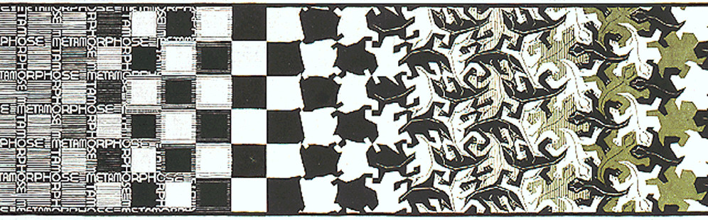

# Exercises week 3

## Practical exercise

For this week's practical exercise, we want you to bring an object to class. This should be a practical object you *like* to use, and use on a more or less daily basis. It should, however, *not* (or not per se) have a *sentimental value* for you. So you could e.g. bring a hammer that you like to work with, but not the hammer that you got from your father for your eighteenth birthday.

During class, we will work on coming up with different descriptions of this object, and we will discuss what the most accurate description will be.

## Textual exercises

__Part 1: Reading__

Read "Concepts we Live By", the first chapter of [*Metaphors we Live By*](https://www.umsl.edu/~alexanderjm/MetaphorsWeLiveBy.pdf)(pp. 3-6). Use the knowledge, insights and vocabulary that we have conveyed during this class to put this text in a broader context.

Again, read the text closely and critically. As you go, process the text: annotate by jotting down questions or comments in the margins, underlining important points, circling keywords, and marking places you may want to revisit. Feel free to underline, scribble, or doodle. 

The processed text will be part of your exercises book. 

__Part 2: Writing__

Given the discussion during our class, the examples we talked about and more that you can find below, create an object of your own that works as a metaphor. Make sure you also document the making process by using photos and / or movies. Also, make a *description* of the object and what it is conveying in a metaphorical way.
