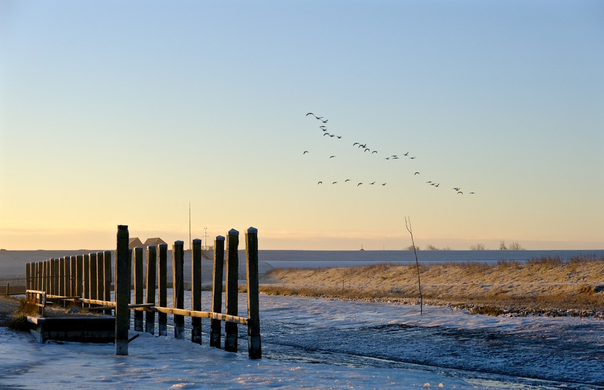

# Rug

=== "NL"
    Met mijn rug 
    naar de wereld 
    sta ik 
    op de dijk 
     
    voor me  
    niets 
    dan leegte 
     
    't is er  
    oorverdovend stil 
     
    Het wad 
    is de ruimte 
    tussen 
     
    wat ik moet 
    en wat ik wil 

=== "EN"

    With my back 
    to the world 
    I stand 
    on the dike 
     
    before me 
    nothing 
    but emptiness 
     
    it is 
    deafeningly still there 
     
    the mudflats 
    are the space 
    between 
     
    what I must do 
    and what I want 
     
    (translation: chatgpt)

– [Inge Zwerver](https://www.wadwicht.nl/index.php)

    

