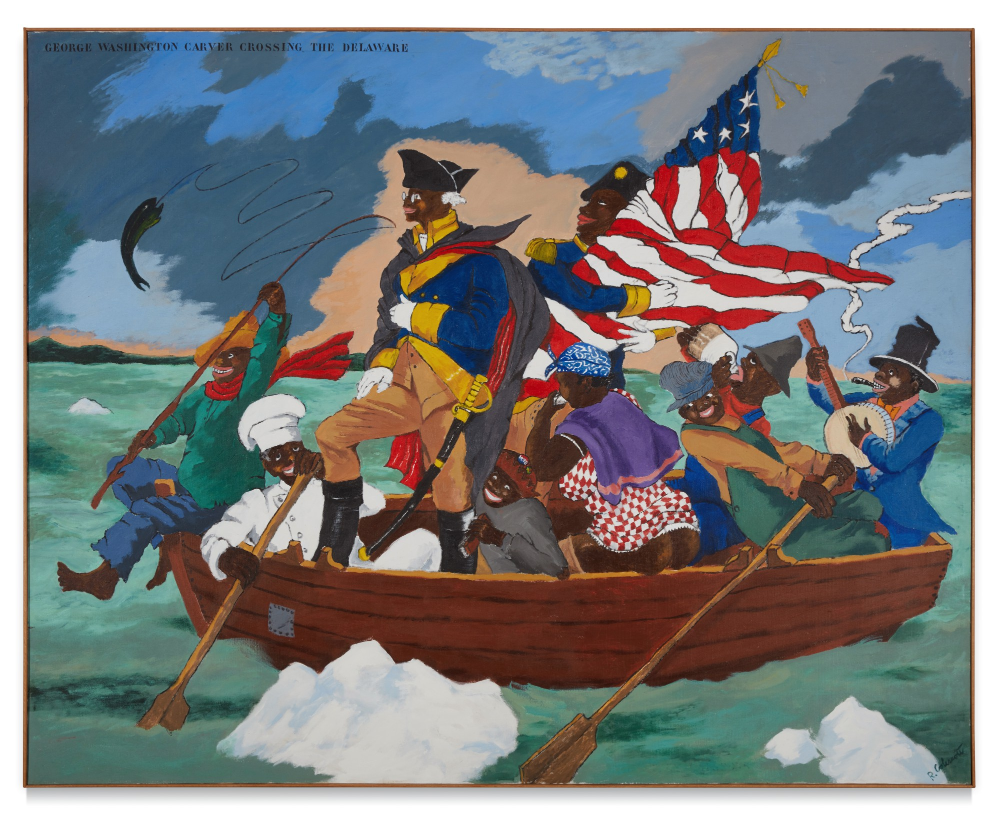

# 5. Presence and Absence

> Daar waar leegte ruimte schept / ontstaan de mooiste dromen.

– Inge Zwerver

## Introduction: The narrative
When we tell or create stories, we always *present* things, but also *leave things out*: the things we do not tell about, that we make not explicit or that we ignore. However, these omissions are just as much part of the story as the things that we *do* tell.

Sometimes, making these left-out parts of the story explicit can create a novel (and often beneficial) view on the narrative; and again, it is the arts that can make the implicit explicit – bring forth the hidden, or hide the explicit.

We have several artistic (literary, creative, ...) practices at our disposal to accomplish such a feat:

- __satire__: vices, follies, abuses, and shortcomings are held up to *ridicule*, often with the intent of exposing or shaming the perceived flaws of individuals, corporations, government, or society itself into improvement. Although satire is usually meant to be *humorous*, its greater purpose is often constructive social criticism, using wit to draw attention to both particular and wider issues in society. ([wikipedia](https://en.wikipedia.org/wiki/Satire)).

- __irony__: a juxtaposition of what *appears* to be the case with what is *actually* or *expected* to be the case. Originally a rhetorical device and literary technique, irony has also come to assume a metaphysical significance with implications for one's attitude towards life. ([wikipedia](https://en.wikipedia.org/wiki/Irony))

- __parody__: a creative work designed to imitate, comment on, or mock its subject by means of satirical or ironic imitation. Often its subject is an original work or some aspect of it, but a parody can also be about a real-life person, an event, or a movement. ([wikipedia](https://en.wikipedia.org/wiki/Parody))

- __exegeration__: the representation of something as more extreme or dramatic than it is. In the arts, exaggerations are used to create emphasis or effect. ([wikipedia](https://en.wikipedia.org/wiki/Exaggeration))

- __pastiche__: a work of visual art, literature, theatre, music, or architecture that imitates the style or character of the work of other artists. Unlike parody, pastiche pays homage to the work it imitates, rather than mocking it. ([wikipedia](https://en.wikipedia.org/wiki/Pastiche))

## Practical exercise

For the practical exercise of this week, we ask you to bring a commercial poster to class – a poster that communicates its convincing message very clear and immediate. The poster should contain both text and images. It is necessary that you bring this poster phyisically (so either a real poster, or a print of one).

Deconstruct or undermine the message of your poster using two deconstructive strategies from the list below. Apply these strategies in such a way that your deconstructed ad parodies or ironizes the original message and reveals a hidden meaning—making present what was previously absent. Clearly describe which two strategies you used.

For inspiration, see: 

- [Robert Colescott: Subverting History with Satire and Color](https://www.theartdistricts.org/news/robert-colescott-subverting-history-with-satire-and-color)

- [Classic Paintings Provide the Perfect Backdrop for Feminist Memes About Mansplaining](https://hyperallergic.com/582404/nicole-tersigni-men-to-avoid-in-art-and-life/)

List of deconstructive strategies you can pay attention to for the assignment:

__Decontextualize / Fragment and Combine__

- Place an image, sentence, or word into another (contradicting) context.
- Add elements (such as images, words, or sentences) that contradict, ironize, undermine, criticize, mock, estrange, exaggerate, trivialize, or make things absurd, and so on.
- Cut parts of the text into pieces and glue them into new (illogical, parodying, critical, ironizing, contradicting, estranging, mocking, absurd, etc.) sentences or statements.
- Strike through certain words.
- Create the opposite, or create ambivalence.
- Create (illogical, parodying, ironizing, contradicting, estranging, mocking, undermining, absurd, etc.) word–image combinations.

__Reverse or queer the Binary Opposition__

- Reveal which concept in the binary opposition dominates the other by reversing the hierarchy — for instance, by swapping the face of a woman with that of a man in a conservative ad, making the male-dominant position and posture suddenly visible. Or turn the word humanity into animality 
- Or queer the binary opposition. Turn the word humanity into humanimality, or turn humanity into humus-ity (Humus is dark, organic material that forms in soil when matter (animal, leaves and so on)  decays, essential to the fertility of the earth)
- Make the opposite dominant, are make present what is absent (what is left out).

## Textual excercise
__Part 1: Reading__

Read the text [*How to write about Africa*](files/How-to-Write-About-Africa.pdf), a satire written in 2005 by [the late Binyavanga Wainaina](https://en.wikipedia.org/wiki/Binyavanga_Wainaina). While reading, make notes and annotations. Describe the technique that Wainaina is using, and what is he is trying to make present or absent. Do you think this text achieves its goal and would it work just as good if it was written by a white American?

As always, the processed text will be part of your exercises book. 

__Part 2: Writing__

## Examples

## Lectures

## Literature