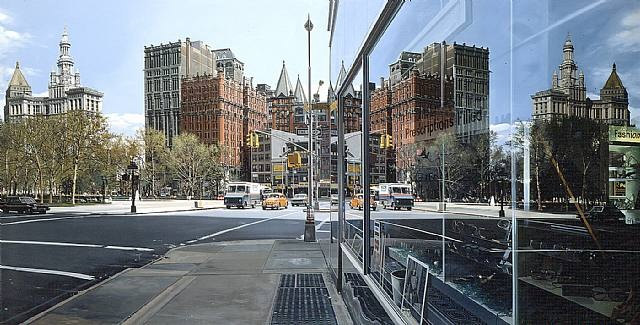

# 5. Presence and Absence

> Daar waar leegte ruimte schept / ontstaan de mooiste dromen.

– Inge Zwerver

## Introduction: The narrative
When we tell or create stories, we always *present* things, but also *leave things out*: the things we do not tell about, that we make not explicit or that we ignore. However, these omissions are just as much part of the story as the things that we *do* tell.

Sometimes, making these left-out parts of the story explicit can create a novel (and often beneficial) view on the narrative; and again, it is the arts that can make the implicit explicit – bring forth the hidden, or hide the explicit.

We have several artistic (literary, creative, ...) practices at our disposal to accomplish such a feat:

- __satire__: vices, follies, abuses, and shortcomings are held up to *ridicule*, often with the intent of exposing or shaming the perceived flaws of individuals, corporations, government, or society itself into improvement. Although satire is usually meant to be *humorous*, its greater purpose is often constructive social criticism, using wit to draw attention to both particular and wider issues in society. ([wikipedia](https://en.wikipedia.org/wiki/Satire)).

- __irony__: a juxtaposition of what *appears* to be the case with what is *actually* or *expected* to be the case. Originally a rhetorical device and literary technique, irony has also come to assume a metaphysical significance with implications for one's attitude towards life. ([wikipedia](https://en.wikipedia.org/wiki/Irony))

- __parody__: a creative work designed to imitate, comment on, or mock its subject by means of satirical or ironic imitation. Often its subject is an original work or some aspect of it, but a parody can also be about a real-life person, an event, or a movement. ([wikipedia](https://en.wikipedia.org/wiki/Parody))

- __exegeration__: the representation of something as more extreme or dramatic than it is. In the arts, exaggerations are used to create emphasis or effect. ([wikipedia](https://en.wikipedia.org/wiki/Exaggeration))

- __pastiche__: a work of visual art, literature, theatre, music, or architecture that imitates the style or character of the work of other artists. Unlike parody, pastiche pays homage to the work it imitates, rather than mocking it. ([wikipedia](https://en.wikipedia.org/wiki/Pastiche))

## Practical exercise

For the practical exercise of this week, we ask you to bring a commercial poster to class – a poster that communicates its convincing message very clear and immediate. The poster should contain both text and images. It is necessary that you bring this poster phyisically (so either a real poster, or a print of one).

## Textual excercise
__Part 1: Reading__

The processed text will be part of your exercises book. 

__Part 2: Writing__

## Examples

## Lectures

## Literature