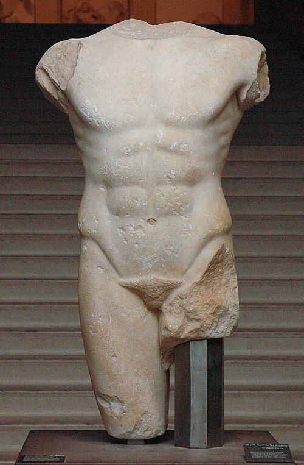

# Archaïscher Torso Apollos

=== "DE"
    Wir kannten nicht sein unerhörtes Haupt, 
    darin die Augenäpfel reiften. Aber 
    sein Torso glüht noch wie ein Kandelaber, 
    in dem sein Schauen, nur zurückgeschraubt, 
     
    sich hält und glänzt. Sonst könnte nicht der Bug 
    der Brust dich blenden, und im leisen Drehen 
    der Lenden könnte nicht ein Lächeln gehen 
    zu jener Mitte, die die Zeugung trug. 
     
    Sonst stünde dieser Stein entstellt und kurz 
    unter der Schultern durchsichtigem Sturz 
    und flimmerte nicht so wie Raubtierfelle; 
     
    und bräche nicht aus allen seinen Rändern 
    aus wie ein Stern: denn da ist keine Stelle, 
    die dich nicht sieht. Du mußt dein Leben ändern.  

=== "EN"

    We cannot know his legendary head 
    with eyes like ripening fruit. And yet his torso 
    is still suffused with brilliance from inside, 
    like a lamp, in which his gaze, now turned to low, 
      
    gleams in all its power. Otherwise 
    the curved breast could not dazzle you so, nor could 
    a smile run through the placid hips and thighs 
    to that dark center where procreation flared. 
      
    Otherwise this stone would seem defaced 
    beneath the translucent cascade of the shoulders 
    and would not glisten like a wild beast’s fur: 
      
    would not, from all the borders of itself, 
    burst like a star: for here there is no place 
    that does not see you. You must change your life. 

    (Translation: [Stephen Mitchell](https://en.wikipedia.org/wiki/Stephen_Mitchell_(translator)))

- [Reiner Maria Rilke](https://en.wikipedia.org/wiki/Rainer_Maria_Rilke) (1875 - 1926)

